# 🏥 MediMind AI - Personal Healthcare Navigation Agent

> An intelligent multi-agent system that empowers individuals to better manage their health through AI-powered symptom analysis, medication management, and doctor visit preparation.

[](https://ai.google.dev/)
[](https://www.python.org/)

**🏆 Google Gemini AI Agents Hackathon 2025**  
**Track:** Agents for Good (Healthcare)

---

## 📖 Table of Contents

- [The Problem](#-the-problem)
- [Our Solution](#-our-solution)
- [Why Agents?](#-why-agents)
- [Architecture](#-architecture)
- [Features](#-features)
- [Tech Stack](#-tech-stack)
- [Getting Started](#-getting-started)
- [Usage Examples](#-usage-examples)
- [Development Roadmap](#-development-roadmap)
- [Project Structure](#-project-structure)
- [Contributing](#-contributing)

---

## 🔍 The Problem

Navigating healthcare is overwhelming for most people. Patients face significant challenges in managing their health effectively:

### **Key Challenges**

**1. Information Overload**
- Medical information is scattered across countless sources
- Complex medical terminology is difficult to understand
- Conflicting information causes confusion and anxiety

**2. Medication Complexity**
- Managing multiple medications with different schedules
- Understanding drug interactions and side effects
- Remembering when and how to take medications

**3. Communication Gap**
- Difficulty articulating symptoms to healthcare providers
- Forgetting important details during doctor appointments
- Not knowing what questions to ask

**4. Lack of Continuity**
- Health information fragmented across multiple appointments
- No centralized system to track symptoms over time
- Previous conversations and concerns are easily forgotten

**5. Limited Accessibility**
- Healthcare advice between appointments is expensive
- Emergency rooms are overused for non-urgent concerns
- Underserved communities lack easy access to guidance

### **The Impact**

- 💊 **50% of patients** don't take medications as prescribed (WHO, 2023)
- 📊 **70% of patients** forget to mention important symptoms during doctor visits
- 💰 Medication non-adherence costs **$100-300 billion annually** in the United States alone
- 🏥 **27% of ER visits** could be handled with better self-care guidance

**The healthcare system needs a bridge** - something that empowers patients to manage their health more effectively while maintaining safety and encouraging professional medical care.

---

## 💡 Our Solution

**MediMind AI** is a personal healthcare assistant powered by Google Gemini that acts as an intelligent companion for managing your health journey.

### **What MediMind Does**

✅ **Analyzes Symptoms Intelligently**
- Asks clarifying questions about your symptoms
- Tracks symptom patterns over time
- Identifies potential red flags requiring immediate medical attention
- Provides organized symptom summaries

✅ **Manages Medications Safely**
- Tracks all your current medications
- Checks for dangerous drug interactions
- Provides medication information and reminders
- Alerts you to potential safety concerns

✅ **Prepares You for Doctor Visits**
- Summarizes your symptoms and health concerns
- Creates chronological timelines of your health
- Generates relevant questions to ask your doctor
- Organizes all information in a clear, printable format

✅ **Maintains Conversation Context**
- Remembers previous discussions within a session
- Builds a long-term health profile across sessions
- Provides personalized responses based on your history
- Respects privacy with local data storage

### **What Makes MediMind Different**

🤖 **Multi-Agent Intelligence**  
Unlike simple chatbots, MediMind uses specialized AI agents that work together, each focusing on their area of expertise - just like a medical team.

🧠 **Contextual Understanding**  
MediMind remembers your health journey, recognizing patterns and providing increasingly personalized assistance over time.

🛡️ **Safety-First Approach**  
Every interaction prioritizes your safety with emergency detection, medical disclaimers, and constant encouragement to consult healthcare professionals.

🆓 **Accessible to All**  
Free, available 24/7, and designed to work for everyone regardless of healthcare access or medical knowledge.

---

## 🤔 Why Agents?

Traditional chatbots provide generic, one-size-fits-all responses. **Agent-based systems are uniquely suited for healthcare** because they mirror how real medical teams operate.

### **The Agent Advantage**

**1. Specialized Expertise**

Just like a medical team has specialists, MediMind has specialized agents:
- **Symptom Analyzer** = Triage nurse who assesses your concerns
- **Medication Manager** = Pharmacist who manages your prescriptions
- **Doctor Prep** = Care coordinator who organizes your information
- **Orchestrator** = Primary care physician who coordinates everything

Each agent excels in its domain, providing deeper and more accurate assistance than a general-purpose chatbot.

**2. Collaborative Workflow**

When you say: *"I have a headache and I'm taking aspirin. Can I take ibuprofen too?"*

- The **Symptom Analyzer** evaluates your headache severity and characteristics
- The **Medication Manager** checks for aspirin-ibuprofen interactions  
- The **Orchestrator** combines their insights with safety warnings
- You receive a comprehensive, multi-faceted response

**3. Stateful Memory**

Agents maintain context across conversations:
- **Session Memory**: Remembers the current conversation flow
- **Long-term Memory**: Builds a persistent health profile over time
- **Context Awareness**: Each response considers your complete health history

**4. Tool Integration**

Agents leverage specialized tools to provide accurate information:
- Medication interaction database
- Symptom knowledge base
- Medical research capabilities (via Google Search)
- Emergency detection algorithms

**5. Adaptive Reasoning**

Agents don't just follow scripts - they reason about your situation:
- Adjust questions based on your responses
- Escalate to emergency protocols when needed
- Combine multiple data points for comprehensive advice
- Learn from interaction patterns to improve over time

---

## 🏗️ Architecture


### **Multi-Agent System Overview**

```mermaid
graph TD
    A[👤 USER INPUT] --> B[🎯 ORCHESTRATOR AGENT<br/>Gemini Flash Latest<br/>• Routes requests<br/>• Maintains context<br/>• Ensures safety]
    
    B --> C[🩺 SYMPTOM<br/>ANALYZER]
    B --> D[💊 MEDS<br/>MANAGER]
    B --> E[👨‍⚕️ DOCTOR<br/>PREP]
    B --> F[💾 MEMORY<br/>BANK]
    
    C --> G[🛠️ TOOLS<br/>• Google Search<br/>• Med Checker<br/>• Symptom DB]
    D --> G
    E --> G
    F --> G
    
    style A fill:#4fc3f7,stroke:#01579b,stroke-width:3px,color:#000
    style B fill:#ffb74d,stroke:#e65100,stroke-width:3px,color:#000
    style C fill:#9e9e9e,stroke:#424242,stroke-width:2px,color:#fff
    style D fill:#9e9e9e,stroke:#424242,stroke-width:2px,color:#fff
    style E fill:#9e9e9e,stroke:#424242,stroke-width:2px,color:#fff
    style F fill:#f06292,stroke:#880e4f,stroke-width:2px,color:#000
    style G fill:#66bb6a,stroke:#1b5e20,stroke-width:3px,color:#000
```


**Agent Workflow:**

1. **User Query** → Sent to Orchestrator
2. **Orchestrator** → Classifies intent and routes to appropriate agent(s)
3. **Specialized Agents** → Process query using their expertise
4. **Tools** → Agents access databases and external resources
5. **Response** → Aggregated and returned to user

---

## 🤖 Agent Interactions Example

Here's how the multi-agent system handles a complex query:

**User:** "I have a headache and I'm taking aspirin. Can I take ibuprofen too?"

1. **Orchestrator** receives the query
2. **Intent Classifier** detects both symptom + medication intent
3. **Symptom Analyzer** analyzes the headache
4. **Medication Manager** checks aspirin + ibuprofen interaction
5. **Orchestrator** combines responses with safety warning
6. **Memory Bank** saves both symptom and medications

**Result:** Comprehensive response with interaction warning and symptom questions.


### **Agent Descriptions**

| Agent | Responsibility | Key Features |
|-------|---------------|--------------|
| **🎯 Orchestrator** | Coordinates all agents, routes queries, ensures safety | Intent classification, emergency detection, response aggregation |
| **🩺 Symptom Analyzer** | Analyzes health symptoms, asks clarifying questions | Red flag detection, symptom tracking, severity assessment |
| **💊 Medication Manager** | Manages medications and checks interactions | Drug interaction database, dosage tracking, safety alerts |
| **👨‍⚕️ Doctor Prep** | Prepares comprehensive summaries for doctor visits | Timeline creation, question generation, information organization |

### **How It Works**

1. **User Input** → User describes their health concern
2. **Intent Classification** → Orchestrator determines which agent(s) should handle it
3. **Agent Processing** → Specialized agent(s) analyze and respond
4. **Tool Utilization** → Agents access databases and tools as needed
5. **Memory Update** → Context saved to session and long-term memory
6. **Response Delivery** → Comprehensive, safe response returned to user

---

## ✨ Features

### ✅ Implemented 

**Multi-Agent System**
- ✅ Orchestrator agent with intelligent intent classification
- ✅ Symptom Analyzer agent with clarifying questions
- ✅ Medication Manager agent with interaction checking
- ✅ Doctor Prep agent for appointment preparation
- ✅ Seamless agent coordination and collaboration

**Memory & Context**
- ✅ Session management for conversation continuity
- ✅ Memory Bank for long-term patient history
- ✅ Context compaction for efficient memory usage
- ✅ Conversation history tracking

**Safety & Intelligence**
- ✅ Emergency keyword detection
- ✅ Medical disclaimer integration
- ✅ Safety-first response protocols
- ✅ Professional medical guidance

**Data & Tools**
- ✅ Symptom knowledge database
- ✅ Medication information database
- ✅ Drug interaction checker
- ✅ Structured logging and tracing

**Observability & Testing** 
- ✅ Performance metrics tracking system
- ✅ Response time monitoring
- ✅ Agent activity analytics
- ✅ Automated test suite (7 tests, 100% pass rate)
- ✅ Session metrics dashboard
- ✅ Error tracking and reporting

**Developer Experience**
- ✅ Clean, modular architecture
- ✅ Comprehensive code documentation
- ✅ Type hints and validation
- ✅ Error handling and logging
- ✅ Comprehensive testing framework

### 🚧 In Development

**Final Polish**
- 🚧 Demo video (3-minute walkthrough)
- 🚧 Architecture diagrams and visuals
- 🚧 Advanced error recovery mechanisms

---

## 🛠️ Tech Stack

### **Core Technologies**

| Component | Technology | Purpose |
|-----------|-----------|---------|
| **AI Model** | Google Gemini Flash (Latest) | Advanced language understanding and generation |
| **Framework** | Google AI Development Kit (ADK) | Agent orchestration and management |
| **Language** | Python 3.8+ | Backend implementation |
| **Validation** | Pydantic | Data validation and type safety |
| **Memory** | Custom Session & Memory Bank | State management and persistence |

### **Key Libraries**


google-genai>=1.0.0       # Gemini API client
python-dotenv>=1.0.0      # Environment management
requests>=2.31.0          # HTTP client
pydantic>=2.0.0           # Data validation
typing-extensions>=4.5.0  # Type hints

### Hackathon Requirements Met

| Requirement | Implementation | Status |
|-------------|---------------|--------|
| **Multi-agent system** | Orchestrator + 3 specialized agents | ✅ Complete |
| **Tools** | Custom medication checker, symptom DB | ✅ Complete |
| **Sessions & Memory** | Session manager + Memory Bank | ✅ Complete |
| **Context Engineering** | Context compaction algorithm | ✅ Complete |
| **Observability** | Structured logging, metrics, tracing | ✅ Complete |
| **Gemini Usage** | Powered by Gemini Flash Latest | ✅ Complete |
| **Agent Evaluation** | Automated test suite (100% pass) | ✅ Complete |
| **Agent Deployment** | Cloud Run deployment planned | Optional  |
---

## 🚀 Setup Instructions

### **Prerequisites**

- Python 3.8 or higher
- Google Gemini API Key ([Get free key](https://aistudio.google.com/apikey))
- Git (optional)

### **Installation**

**1. Clone the repository**

git clone https://github.com/ali-mir-07/medimind_ai.git
cd medimind-ai

**2. Create virtual environment**

```bash
python -m venv .venv
```
### Activate (Windows)
```
.venv\Scripts\activate
```
### Activate (Mac/Linux)
```
source .venv/bin/activate
```
**3. Insatll Dependencies**
```bash
pip install -r requirements.txt
```

**4. Configure environment variables**
### Copy example file
```
copy .env.example .env  # Windows
# cp .env.example .env  # Mac/Linux
```
### Edit .env and add your API key
```
notepad .env  # Windows
### nano .env   # Mac/Linux
```
### Add your Gemini API key:
GOOGLE_API_KEY=your_actual_api_key_here

**5. Run the application**
```bash
python src/main.py
```

# Expected Output:
## 🏥 MediMind AI - Personal Healthcare Assistant
==================================================
✅ Gemini client initialized
✅ Agent configuration created

Type 'quit' to exit
--------------------------------------------------

👤 You:

Example Usage:
Symptom Analysis:
👤 You: I've had a severe headache for 2 days and feel nauseous

🤖 MediMind (SymptomAnalyzer): I understand you've been experiencing a 
severe headache and nausea for 2 days. Let me ask some questions to 
better understand your symptoms:

1. On a scale of 1-10, how severe is the headache right now?
2. Where is the pain located (temples, forehead, back of head)?
3. Is the pain throbbing, dull, or sharp?
4. Are you sensitive to light or sound?
5. Have you taken any medication for this?

Please note: If this is the worst headache you've ever experienced 
or if it came on suddenly, please seek immediate medical attention.

Medication Interaction Check:
👤 You: I take aspirin every morning for my heart. Can I also take 
ibuprofen for back pain?

🤖 MediMind (MedicationManager): Thank you for checking before 
combining medications. Here's what you should know:

⚠️ POTENTIAL INTERACTION DETECTED

**Aspirin + Ibuprofen:**
- Severity: MODERATE
- Both are NSAIDs (non-steroidal anti-inflammatory drugs)
- Taking together significantly increases risk of:
  • Stomach bleeding and ulcers
  • Reduced effectiveness of aspirin's heart protection
  • Kidney problems with long-term use

**Recommendation:**
- DO NOT take these together without doctor approval
- If you must take both, space them at least 8 hours apart
- Consider acetaminophen (Tylenol) instead for pain relief
- IMPORTANT: Consult your doctor or pharmacist before combining

Your safety is important. Please discuss this with your healthcare 
provider, especially since you're taking aspirin for heart health.

Doctor Visit Prepration:
👤 You: I have a doctor appointment tomorrow. Can you help me prepare?

🤖 MediMind (DoctorPrep): I'll help you prepare for your appointment! 
Based on our conversation, here's a comprehensive summary:

**SYMPTOMS SUMMARY**
• Severe headache (Duration: 2 days, Severity: Not yet specified)
• Nausea (Associated with headache)
• Back pain (Reason for medication question)

**CURRENT MEDICATIONS**
• Aspirin (daily, for heart health)

**CONCERNS & QUESTIONS TO ASK YOUR DOCTOR**

1. Headache & Nausea:
   - "I've had a severe headache with nausea for 2 days. What could 
     be causing this?"
   - "Are there any tests we should run to rule out serious causes?"
   - "What treatment do you recommend?"

2. Medication for Back Pain:
   - "I have back pain but I'm taking daily aspirin. What pain reliever 
     is safe for me to use?"
   - "Are there any non-medication approaches I should try first?"

3. General Health:
   - "How is my current medication (aspirin) working for my heart health?"
   - "Are there any lifestyle changes I should make?"

**TIMELINE**
• 2 days ago: Headache and nausea began
• Today: Experiencing back pain, sought medication advice

💡 Tip: Print or screenshot this summary to bring to your appointment!

You can also ask general health questions to medimind_ai your personal health assistant
And if you want to end session type quit, exit, or bye 

---

## 🧪 Testing

MediMind AI includes a comprehensive automated test suite to ensure reliability and quality.

### Running Tests

```bash
# Run the complete test suite
python tests/test_agents.py
```

### 🧪 Test Coverage

The test suite validates the following components:

| Test Case | Description | Status |
| :--- | :--- | :---: |
| **Orchestrator Initialization** | Verifies all agents initialize correctly | ✅ Pass |
| **Symptom Analysis** | Tests symptom analyzer routing and response | ✅ Pass |
| **Medication Interaction** | Validates drug interaction detection | ✅ Pass |
| **Doctor Prep** | Confirms appointment summary generation | ✅ Pass |
| **Emergency Detection** | Tests emergency keyword escalation | ✅ Pass |
| **Intent Classification** | Validates query routing accuracy | ✅ Pass |
| **Session Management** | Tests memory and context tracking | ✅ Pass |

### Current Test Results:

- ✅ 7/7 tests passing
- ✅ 100% success rate
- ✅ All core features validated

### Performance Metrics:
--- 
When you will quit the application, you'll see comprehensive session metrics:

---

============================================================
📊 MEDIMIND AI - SESSION METRICS & PERFORMANCE
============================================================

⏱️  Session Duration: 0:01:43
📈 Total Requests: 3
✅ Success Rate: 100.0%

⚡ Performance:
  • Average Response Time: 3.25s
  • Fastest Response: 1.12s
  • Slowest Response: 5.15s

🤖 Agent Activity:
  • Orchestrator: 3 calls (100.0%)
  • Symptom Analyzer: 1 calls (33.3%)
  • Medication Manager: 1 calls (33.3%)
  • Doctor Prep: 1 calls (33.3%)

🛡️  Safety Metrics:
  • Emergency Detections: 0
  • Drug Interaction Checks: 1
  • Errors: 0
============================================================

<details>
<summary><b>📅 Development Roadmap & Project Details</b> (Click to expand)</summary>

<br>

## 📅 Development Roadmap

### ✅ Completed Features

**Foundation & Core System**
- ✅ Project setup and configuration
- ✅ Gemini API integration
- ✅ Base agent architecture
- ✅ Orchestrator agent with intent classification

**Specialized Agents**
- ✅ Symptom Analyzer agent
- ✅ Medication Manager agent
- ✅ Doctor Prep agent
- ✅ Agent coordination and routing

**Data & Intelligence**
- ✅ Symptom knowledge database
- ✅ Medication information database
- ✅ Drug interaction checker
- ✅ Emergency detection system

**Memory & State**
- ✅ Session management
- ✅ Conversation history tracking
- ✅ Memory Bank for long-term storage
- ✅ Context compaction

**Developer Experience**
- ✅ Modular architecture
- ✅ Comprehensive documentation
- ✅ Error handling and logging
- ✅ Configuration management

**Observability, Testing & Documentation**
- ✅ Performance metrics tracking system
- ✅ Response time monitoring
- ✅ Agent activity analytics
- ✅ Session metrics dashboard
- ✅ Automated testing framework
- ✅ 7 comprehensive tests (100% pass rate)
- ✅ Test coverage for all agents
- ✅ Emergency detection validation
- ✅ Interaction checking validation
- ✅ Technical documentation (WRITEUP.md)
- ✅ Enhanced code quality and comments
---

### 🚧 Under Development and Optionals

**Documentation & Presentation**
- 📅 Demo video (3-minute walkthrough)
- 📅 Architecture diagrams
- 📅 Screenshots and visuals
- 📅 Final README polish

**Possible Optional Enhancements**
- 📅 Google Search tool integration
- 📅 Agent deployment (Google Cloud Run)
- 📅 Production configuration
- 📅 Deployment documentation


--- 
## Challenges & Solutions

**Challenge 1: API Model Selection**
- ❌ Initial model (`gemini-2.0-flash-exp`) had limited free tier quota
- ✅ Switched to `gemini-flash-latest` with better free tier limits

**Challenge 2: Medical Safety**
- ❌ Risk of providing harmful medical advice
- ✅ Implemented strict safety protocols, disclaimers, and emergency detection

**Challenge 3: Context Management**
- ❌ Long medical conversations exceed token limits
- ✅ Implemented context compaction and memory bank

**Challenge 4: Testing Multi-Agent Systems** 
- ❌ Complex interactions between agents difficult to validate
- ✅ Built comprehensive test suite with 7 automated tests covering all agent workflows

**Challenge 5: Performance Monitoring** 
- ❌ No visibility into system performance and agent activity
- ✅ Implemented MetricsTracker with real-time performance analytics

---

## 🔮 Future Enhancements

**Post-Hackathon Features**
- Voice interface for accessibility
- Multi-language support for global reach
- Integration with wearable health devices
- Mobile app (iOS/Android)
- Push notifications for medication reminders
- Export health summaries to PDF

**Long-term Vision**
- Integration with Electronic Health Records (EHR)
- Telemedicine appointment booking
- AI-powered health insights and trend analysis
- Family health management dashboard
- Healthcare provider portal

</details>

---

## 🙏 Acknowledgments

**Special Thanks To:**
- **Google Gemini Team** for providing powerful AI models and the AI Development Kit
- **Healthcare Professionals** who inspired this solution with their invaluable insights
- **Open Source Community** for the amazing tools and frameworks that made this possible
- **Kaggle & Google** for hosting this incredible hackathon and providing a platform to showcase innovation

---

## 📧 Contact

**Developer:** Muhammad Ali Mir  
**Email:** muhammadalimir191@gmail.com | malimir911@gmail.com  
**GitHub:** [@ali-mir-07](https://github.com/ali-mir-07)  
**Project:** [MediMind AI](https://github.com/ali-mir-07/medimind_ai)


---

## 📚 Resources

### Documentation
- **README.md** - This file (Complete Project Deatails, User Guide and Setup)
- **WRITEUP.md** - Comprehensive technical writeup for elvaluation
- **Code Comments** - Inline documentation throughout codebase

### Testing & Quality
- **Test Suite** - Run `python tests/test_agents.py`
- **Performance Metrics** - Displayed on application exit
- **Logging** - Structured logs in console output

### Data & Knowledge Bases
- **symptoms.json** - Common symptoms with red flags
- **medications.json** - Medication information database
- **interactions.json** - Drug interaction warnings

### External Links
- **Gemini API** - https://ai.google.dev/
- **ADK Python** - https://github.com/google/adk-python
- **Hackathon** - Kaggle x Google Gemini AI Agents 2025

---

## ⚠️ Medical Disclaimer

**MediMind AI is NOT a substitute for professional medical advice, diagnosis, or treatment.**

- ✅ Always seek the advice of your physician or qualified health provider with any questions regarding a medical condition
- ✅ Never disregard professional medical advice or delay seeking it because of information from this application
- ✅ In case of emergency, call your doctor or emergency services immediately

**This tool is designed to help organize health information, NOT to replace professional medical care.**

---

<div align="center">

### 💙 Thank You for Visiting! 💙

**Special thanks to Google and Kaggle for providing this platform to demonstrate skills and innovation.**

**Built with ❤️ for Better Healthcare Accessibility**

⭐ **If you found this project helpful, please give it a star!** ⭐

---

**Powered by** [Google Gemini](https://ai.google.dev/) | **Built with** [Python](https://www.python.org/) | **Hackathon:** Kaggle x Google 2025

</div>